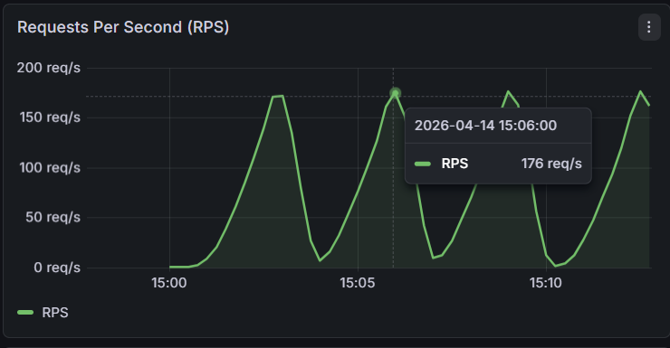
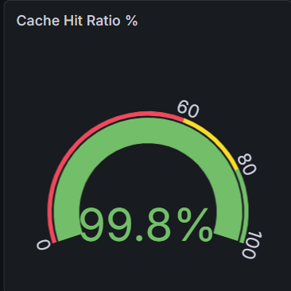
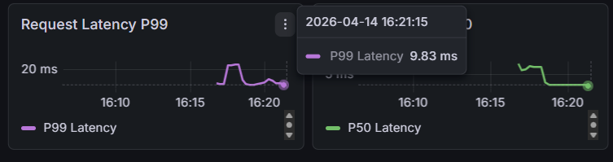
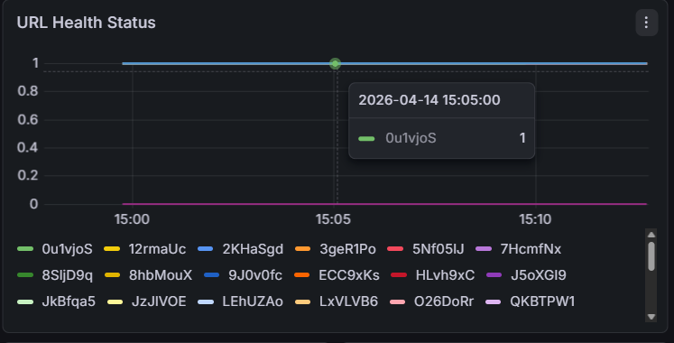

# URLify — Production-Grade URL Shortener in Go

A fully observable, containerized URL shortener built to demonstrate
real backend engineering patterns used in production systems.

[](https://golang.org)
[](https://postgresql.org)
[](https://redis.io)
[](https://prometheus.io)
[](https://grafana.com)
[](https://docker.com)

---
## Key Features

- High-performance URL redirection using Redis cache-aside pattern
- Distributed rate limiting using Redis Lua scripts
- JWT-based authentication and authorization
- Background health monitoring worker pool
- Full observability stack (Prometheus + Grafana)
- Containerized deployment with Docker Compose
- Production-ready graceful shutdown handling
- Load-tested using k6

## What This Project Demonstrates

| Concept | Implementation |
|---|---|
| Cache-aside pattern | Redis-first redirect resolution with PostgreSQL fallback |
| Atomic distributed rate limiting | Token bucket algorithm via Redis Lua scripts |
| Go concurrency | Bounded goroutine worker pool for URL health monitoring |
| Graceful shutdown | OS signal handling with in-flight request draining |
| Observability | Prometheus metrics + Grafana dashboards + alerting rules |
| Production containerization | Multi-stage Docker build (~15MB image) |
| Relational modeling | PostgreSQL with connection pooling via sqlx |
| JWT authentication | HS256 signed tokens with bcrypt password hashing |

---
## Tech Stack

### Backend


### Infrastructure


### Observability


### Testing


### Security


---

## Architecture

```
┌──────────────────────────────────────────────────────────────┐
│                          Client                              │
└──────────────────────────────┬───────────────────────────────┘
                               │
                               ▼
┌──────────────────────────────────────────────────────────────┐
│                      Gin HTTP Router                         │
│                                                              │
│  ┌──────────────────┐    ┌───────────────────────────────┐   │
│  │ Logger Middleware│    │ Rate Limiter Middleware        │   │
│  │ (Prometheus +    │    │ (Redis Lua Token Bucket)       │   │
│  │  structured log) │    │ X-RateLimit-* headers         │   │
│  └──────────────────┘    └───────────────────────────────┘   │
│                                                              │
│  ┌────────────────────────────────────────────────────────┐  │
│  │                   Route Handlers                       │  │
│  │                                                        │  │
│  │  POST /auth/signup     POST /auth/login                │  │
│  │  POST /urls            GET  /urls                      │  │
│  │  DELETE /urls/:id      GET  /r/:shortcode              │  │
│  │  GET  /metrics         GET  /stats                     │  │
│  └───────────────────────────┬────────────────────────────┘  │
└──────────────────────────────┼───────────────────────────────┘
                               │
               ┌───────────────┼──────────────┐
               ▼               ▼              ▼
      ┌──────────────┐  ┌───────────┐  ┌──────────────┐
      │   Services   │  │   Redis   │  │  PostgreSQL  │
      │              │  │           │  │              │
      │  Redirect    │  │  Cache    │  │  users       │
      │  Service     │  │  redirect │  │  urls        │
      │  (cache-     │  │  :{code}  │  │  url_metrics │
      │   aside)     │  │           │  │              │
      └──────────────┘  │  Rate     │  └──────────────┘
                        │  Limiting │
                        │  ratelimit│
                        │  :{ip}    │
                        └───────────┘

━━━━━━━━━━━━━━━━━━━━━━━━━━━━━━━━━━━━━━━━━━━━━━━━━━━━━━━━━━━━━━

Background Worker (goroutine pool — runs independently)

  Ticker (configurable interval, default 5 min)
        │
        ▼
  Fetch all URLs from PostgreSQL
        │
        ▼
  Push into buffered jobs channel
        │
  ┌─────┴──────────────────────┐
  ▼      ▼      ▼      ▼      ▼    ← N workers (configurable)
  W1     W2     W3     W4     W5
        │
        ▼
  HTTP GET (10s timeout, no redirect follow)
        │
   ┌────┴────┐
   UP      DOWN/TIMEOUT
        │
        ▼
  UPDATE url_metrics (PostgreSQL)
  UPDATE Prometheus gauge per short_code

━━━━━━━━━━━━━━━━━━━━━━━━━━━━━━━━━━━━━━━━━━━━━━━━━━━━━━━━━━━━━━

Observability Stack

  URLify /metrics
        │
        ▼ scrape every 5s
  Prometheus (port 9090)
        │
        ▼ query
  Grafana (port 3000)
        │
        ▼
  Production Dashboard (11 panels)
  + 3 Alerting Rules
```

---

## Redirect Flow — Cache-Aside Pattern

```
GET /r/:shortcode
        │
        ▼
Redis lookup → key: "redirect:{shortcode}"
        │
   HIT──┴──MISS
   │         │
   │         ▼
   │    PostgreSQL lookup
   │    GetByShortCode()
   │         │
   │    Write to Redis
   │    TTL: 24 hours
   │         │
   └────┬────┘
        ▼
301 Moved Permanently → Location: {original_url}
X-Cache: HIT | MISS
```

On first request for any shortcode, PostgreSQL is queried once
and the result is cached in Redis for 24 hours. Every subsequent
request is served entirely from Redis at sub-millisecond latency.

**Cache invalidation** is handled on URL deletion — the Redis key is
removed immediately so deleted URLs stop resolving within the
same request cycle.

---

## Rate Limiting — Token Bucket via Redis Lua

```
Each IP → Redis hash key: "ratelimit:{ip}"
  Fields:  tokens      (current count)
           last_refill (unix timestamp)

Request arrives
        │
        ▼
Lua script executes atomically in Redis
        │
  Calculate elapsed seconds since last_refill
  Add (elapsed × refill_rate) tokens
  Cap at capacity
        │
  tokens ≥ 1?
   YES──┴──NO
   │        │
   │        ▼
   │   429 Too Many Requests
   │   + Retry-After header
   │
   ▼
  Consume 1 token
  Allow request
```

The Lua script is atomic — Redis executes it without interruption.
A non-atomic read-modify-write in Go would allow concurrent
requests to consume the same token under load, breaking the
rate limiter entirely.

Response headers on every request:
```
X-RateLimit-Limit: 10
X-RateLimit-Remaining: 7
X-RateLimit-Refill-Rate: 1
```

---

## Observability Stack

### Prometheus Metrics

| Metric | Type | Labels | Description |
|---|---|---|---|
| `urlify_http_requests_total` | Counter | method, path, status | All HTTP requests |
| `urlify_http_request_duration_seconds` | Histogram | method, path | Latency distribution |
| `urlify_redirects_total` | Counter | — | Successful redirects |
| `urlify_redirect_cache_hits_total` | Counter | — | Redis cache hits |
| `urlify_redirect_cache_misses_total` | Counter | — | PostgreSQL fallbacks |
| `urlify_rate_limited_requests_total` | Counter | — | Rejected requests |
| `urlify_active_urls` | Gauge | — | Currently registered URLs |
| `urlify_urls_created_total` | Counter | — | URLs created since startup |
| `urlify_urls_deleted_total` | Counter | — | URLs deleted since startup |
| `urlify_url_status` | Gauge | short_code | Per-URL health (1=UP 0=DOWN) |
| `urlify_health_check_cycles_total` | Counter | — | Completed worker cycles |
| `urlify_health_check_duration_seconds` | Histogram | — | Worker cycle duration |

### Live Grafana Dashboard Snapshot

You can view the production monitoring dashboard here:

🔗 **Public Snapshot:**
https://snapshots.raintank.io/dashboard/snapshot/Q2iG099Sq3ky6Fx9DjoSM51p2JoU3VQx

This dashboard visualizes:

* Requests per second (RPS)
* Cache hit vs miss ratio
* Error rate
* P99 latency
* Rate limiting behavior
* URL health monitoring

The system was load tested using **k6**, and metrics were collected via **Prometheus** and visualized using **Grafana**.

### Key Metrics

| Metric | Visualization |
|--------|--------------|
| *Request Rate (RPS)* |  |
| *Cache Hit Ratio* |  |
| *P99 Latency* |  |
| *URL Health Status* |  |

Key PromQL queries:

```promql
# Requests per second
sum(rate(urlify_http_requests_total[1m]))

# Cache hit ratio
100 * rate(urlify_redirect_cache_hits_total[5m])
    / clamp_min(
        rate(urlify_redirect_cache_hits_total[5m])
        + rate(urlify_redirect_cache_misses_total[5m]),
      1)

# P99 request latency
histogram_quantile(0.99,
  sum(rate(urlify_http_request_duration_seconds_bucket[5m])) by (le)
)

# Error rate
100 * sum(rate(urlify_http_requests_total{status=~"5.."}[1m]))
    / clamp_min(sum(rate(urlify_http_requests_total[1m])), 1)
```

### Grafana Alert Rules

| Alert | Condition | Window | Severity |
|---|---|---|---|
| High Error Rate | Error rate > 5% | 2 min | Critical |
| Low Cache Hit Ratio | Hit ratio < 80% | 5 min | Warning |
| Rate Limiter Spike | Rejected > 10 req/s | 1 min | Warning |

---

## API Reference

### Authentication

```
POST /auth/signup
Body: { "email": "user@example.com", "password": "secret123" }
Response 201: { "token": "eyJ...", "user": { "id", "email", "role" } }

POST /auth/login
Body: { "email": "user@example.com", "password": "secret123" }
Response 200: { "token": "eyJ...", "user": { "id", "email", "role" } }
```

### URL Management — Protected (Bearer Token)

```
POST /urls
Body: { "original_url": "https://example.com", "custom_code": "mycode" }
Response 201: { "short_code", "short_url", "original_url", "is_custom" }

GET /urls?page=1&limit=10
Response 200: { "data": [...], "total", "page", "limit", "total_pages" }

DELETE /urls/:id
Response 200: { "message": "URL deleted successfully" }
```

### Redirect — Public

```
GET /r/:shortcode
Response 301: Location → original URL
Headers: X-Cache: HIT | MISS
```

### Observability — Public

```
GET /metrics    Prometheus exposition format
GET /stats      JSON system summary
```

---

## Getting Started

### Prerequisites

- Go 1.22+
- Docker Desktop

### One-Command Setup

```bash
git clone https://github.com/yourusername/urlify.git
cd urlify

cp .env.example .env
# Set a secure JWT_SECRET in .env

docker compose up --build
```

| Service | URL |
|---|---|
| URLify API | http://localhost:8080 |
| Prometheus | http://localhost:9090 |
| Grafana | http://localhost:3000 |

Grafana credentials are defined in the `.env` file.

⚠️ Never commit real credentials to source control.

Dashboard is auto-provisioned — navigate to
**Dashboards → urlify → urlify Production Dashboard**.

### Local Development (Without Docker App Container)

```bash
# Start infrastructure only
docker compose up -d postgres redis prometheus grafana

# Run Go app natively (faster iteration)
go run cmd/server/main.go
```

### Load Testing with k6

```bash
# Install k6
# Windows: winget install k6

# Login first, copy JWT token into k6/load_test.js
k6 run k6/load_test.js
```

Watch all 11 Grafana panels respond live during the test.

---
## Performance Characteristics

### Load Test Environment:

* Local development machine
* Docker Compose deployment
* Go + Redis + PostgreSQL + Prometheus + Grafana

### Load test configuration:

* Tool: k6
* Peak load: 50 virtual users
* Test duration: ~3 minutes
* Target endpoint: redirect service

### Benchmark Results:

| Metric | Value |
|--------|------|
| Throughput | **376 requests/sec** |
| P99 Latency | **9.83 ms** |
| Cache Hit Ratio | **99.8%** |
| Error Rate | **< 1%** |

**Note:**

During benchmarking, rate limits were temporarily increased to measure system throughput without artificial throttling.
With default rate limits enabled, the system correctly enforced request limits under load.


---
## Project Structure

```
urlify/
├── cmd/server/main.go              Entry point, graceful shutdown
├── config/config.go                Typed config from environment
├── db/
│   ├── postgres.go                 Connection pool + auto migrations
│   └── redis.go                    Redis client initialisation
├── grafana/
│   ├── dashboards/
│   │   └── urlify.json             Provisioned dashboard (11 panels)
│   └── provisioning/
│       ├── dashboards/
│       │   └── dashboard.yml       Dashboard provider config
│       └── datasources/
│           └── prometheus.yml      Auto-wired Prometheus datasource
├── k6-test/
│   └── load_test.js                Staged load test with setup/teardown
    └── redirect_benchmark.js       Staged load test to measure performance 
    └── test1_headers.js
    └── test2_exhaust_bucket.js
    └── test3_refill.js
    └── test4_atomicity.js
├── metrics/
│   └── metrics.go                  All Prometheus metric definitions
├── middleware/
│   ├── auth.go                     JWT validation middleware
│   ├── logger.go                   Structured logger + metrics recording
│   └── ratelimiter.go              Lua token bucket rate limiter
├── models/
│   ├── url.go                      URL + metrics DB queries
│   └── user.go                     User DB queries
├── routes/
│   ├── auth.go                     Signup + login handlers
│   ├── metrics.go                  /stats JSON handler
│   ├── redirect.go                 Cache-aside redirect handler
│   ├── routes.go                   Router wiring
│   └── url.go                      URL CRUD handlers
├── services/
│   └── redirect_service.go         Cache-aside resolution logic
├── utils/
│   ├── hash.go                     bcrypt helpers
│   ├── jwt.go                      JWT sign + parse + claims
│   ├── shortcode.go                crypto/rand shortcode generator
│   └── validator.go                Shared struct validator
├── worker/
│   └── health_checker.go           Goroutine pool health monitor
├── prometheus.yml                  Prometheus scrape config
├── Dockerfile                      Multi-stage build (~15MB image)
├── docker-compose.yml              Full 5-service orchestration
├── .env.example                    Config template
└── README.md
```

---

## Environment Variables

| Variable | Default | Description |
|---|---|---|
| `APP_PORT` | `8080` | HTTP server port |
| `APP_ENV` | `development` | Environment name |
| `DB_HOST` | `localhost` | PostgreSQL host |
| `DB_PORT` | `5432` | PostgreSQL port |
| `DB_USER` | `urlify` | PostgreSQL user |
| `DB_PASSWORD` | — | PostgreSQL password |
| `DB_NAME` | `urlify_db` | PostgreSQL database name |
| `DB_SSLMODE` | `disable` | PostgreSQL SSL mode |
| `REDIS_HOST` | `localhost` | Redis host |
| `REDIS_PORT` | `6379` | Redis port |
| `REDIS_PASSWORD` | — | Redis password (optional) |
| `JWT_SECRET` | — | JWT signing secret (required) |
| `JWT_EXPIRY_HOURS` | `24` | Token expiry in hours |
| `RATE_LIMIT_CAPACITY` | `10` | Max tokens per IP |
| `RATE_LIMIT_REFILL_RATE` | `1` | Tokens refilled per second |
| `HEALTH_CHECK_INTERVAL_SECONDS` | `300` | Worker tick interval |
| `HEALTH_CHECK_WORKER_POOL_SIZE` | `10` | Concurrent health workers |

---

## Docker Services

```
docker compose up --build

Service       Port    Description
──────────────────────────────────────────
urlify_app    8080    Go API server
urlify_pg     5432    PostgreSQL 15
urlify_redis  6379    Redis 7
prometheus    9090    Prometheus scraper
grafana       3000    Grafana dashboards
```

Postgres data persists in a named volume across restarts.
Grafana state persists in a named volume — dashboards and
alerts survive container restarts.

To reset everything:
```bash
docker compose down -v
```

---
## Production Considerations

This project demonstrates production-ready patterns but is configured for local development.

The system is fully containerized using Docker Compose and can be deployed to any cloud platform supporting container workloads (Render, AWS, GCP, Azure).

Recommended changes for production:

- Use secure secrets management (Vault / AWS Secrets Manager)
- Enable HTTPS (TLS termination via reverse proxy)
- Configure persistent backups for PostgreSQL
- Set strong passwords for all services
- Enable authentication for Prometheus and Grafana
- Configure horizontal scaling behind a load balancer

---

## License

MIT